# 基于STC32G无感无刷电机驱动方案开源啦

#### 一、无刷电机原理

#### 1.1.无刷电机内部结构

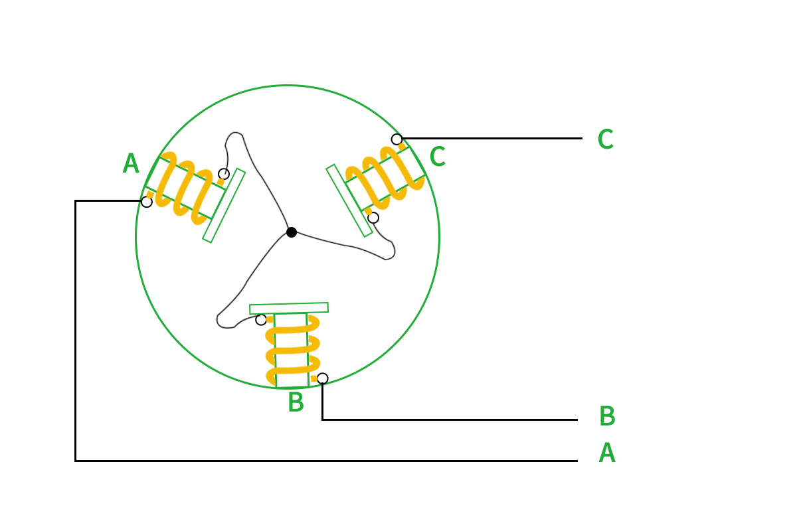
上图为无刷电机的基本模型示意，电机内部有三个线圈，每个线圈的一端都连接起来，另外一端引出到外部，中间有一个具有N/S两极的永磁铁内转子。如果我们按照一定的顺序给电机通电，转子就可以旋转起来。我们举例几种给电的情况来进行简单分析和模拟：

#### 1.2.无刷电机旋转原理

a.给A通正电压，B通负电压。
A相产生的磁场会吸引转子的S极，B相线圈产生的磁场会吸引转子的N极，转子会转到向左倾斜的位置，如下图所示。（其中每一相产生的磁场我们需要使用右手螺旋定则判断磁场的南极与北极）
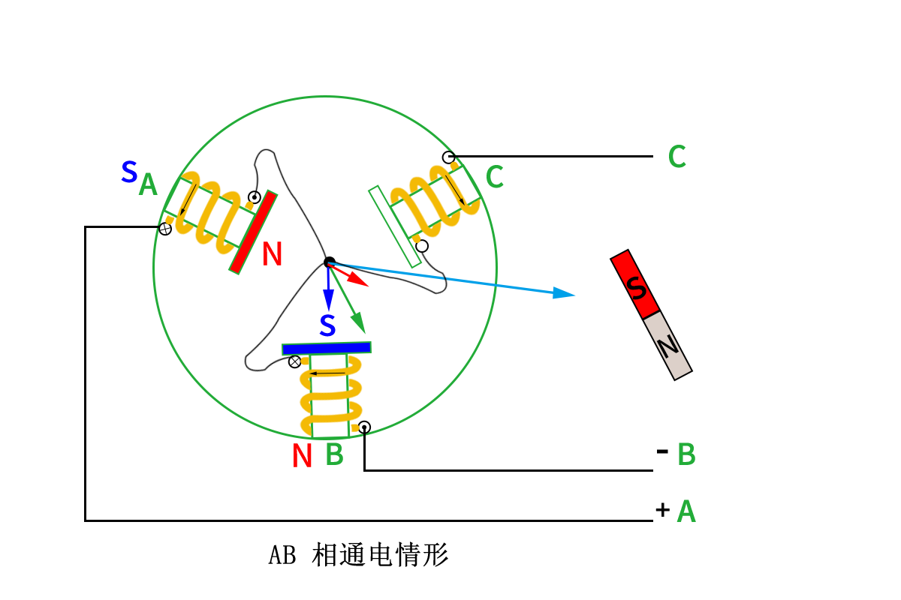
b. 给A通正电压，C通负电压。
A相产生的磁场会吸引转子的S极，C相线圈产生的磁场会吸引转子的N极，转子会转到水平位置，如下图所示。
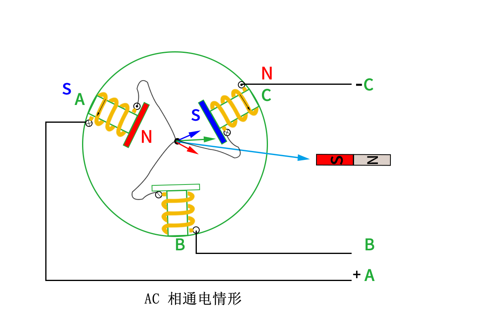
c. 给B通正电压，C通负电压。
B相产生的磁场会吸引转子的S极，C相线圈产生的磁场会吸引转子的N极，转子会转到向右倾斜的位置，如下图所示。
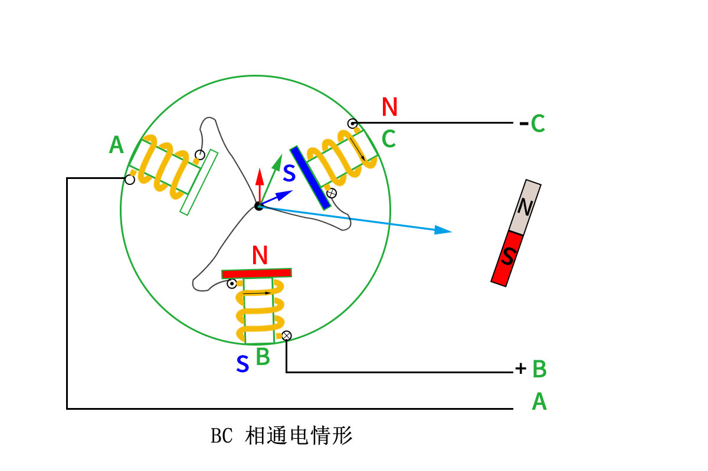
d.给B通正电压，A通负电压。
B相产生的磁场会吸引转子的S极，A相线圈产生的磁场会吸引转子的N极，转子会转到向左倾斜的位置和a种情况类似但转子的南北极相反，如下图所示。
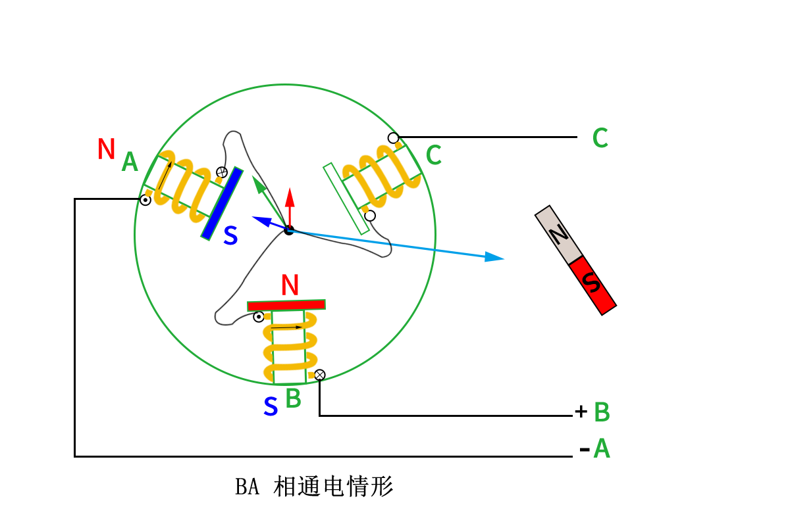
根据前四次的举例，我们可以得出第5、第6次也可以依次类推。
最终我们总结一下每次换相之后转子到达的位置，转动一圈需要换相6次，每次换相角度为60度，如下图所示

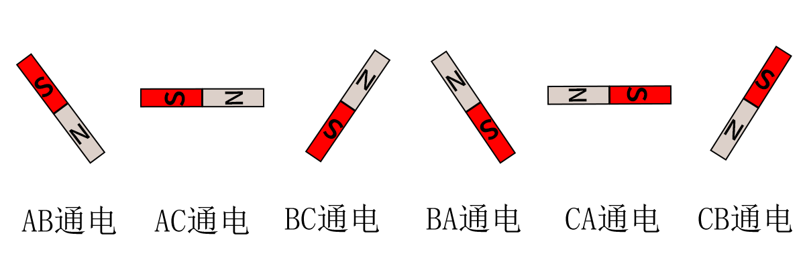

以上就是我们控制无刷电机转动的基本原理了，但是要真正的实现无刷电机的驱动，我们还缺少一个最重要的东西，就是如何知道转子已经到达预定位置，因为我们只有知道了转子到达了预定位置之后才能进行换相，这样电机才能顺滑的运转。转子位置检测常用的有三种方式。
方式一：通过过零检测，三相相电压与电机中性点电压进行比较。过零检测的优点在于电机与驱动连接的线较少，但是缺点在于启动的时候需要开环启动，会导致低速的时候控制效果差，并且硬件电路会更加复杂。

方式二：通过安装霍尔检测转子位置，一共安装三个霍尔分别间隔120度安装，霍尔输出的波形如下图所示(使用逻辑分析仪采集到的波形)，每当波形改变的时候就需要进行换相。优点是电路结构简单，缺点是电机成本会稍微高一点点。

方式三：加装磁编码器直接检测转子具体的位置。这种方式成本会高很多。

我们推荐选择方式一，负压电磁组对于低速可以说完全没有需求，这样也就避开了过零检测的缺点，并且负压电磁组对车模整体是越轻越好，采用无感的方式可以降低电机与驱动之间的连线，并且电机也可以更轻，电路上通常需要增加运放、比较器等电路，我们也可以通过使用单片机内部的运放与比较器来实现电路的简化。因此过零检测的方式对于负压电磁组来说是非常合适的。

#### 二、无感无刷基础知识与选型

#### 2.1.逐飞STC无感无刷驱动开源项目的电机控制芯片选型
本开源项目选用STC32G12K128-LQFP48驱动无刷电机，这款单片机特点如下：
1.主频最大可达35MHz。
2.两组8通道PWM通道。
3.一个比较器，比较器输入端可以连接到ADC通道或者IO。
4.宽范围工作电压1.9-5.5。
5.UART数量有4个。

#### 2.2.逐飞STC无感无刷驱动基础知识概述
有感无刷电机我们可以通过电机内部的霍尔判断转子当前的位置，然后无感无刷则只有三根相线。因此无感无刷电路上稍微复杂一点，会多一个反电动检测电路，通过判断未通电的那项过零来判断电机是否应该进行换相。反电动势检测电路主要有分压电路与比较电路构成。逐飞基于STC32G制作的无感无刷电调使用了单片机内部的比较器，因此外围电路非常的简单，可以大幅度缩小板子的面积。

接下来我们简单描述一下分压电路与比较器电路的作用，分压电路是为了将反电动的电压降低到比较器或者MCU可承受范围内，而比较器是用于判断反电动势过零信号的，我们将未通电的相的反电动势与电机中性点电压进行比较，当反电动势从负逐渐上涨超过电机中性点电压的时候，或者当反电动势从正逐渐下降低于电机中性点电压的时候就捕获到一个过零信号。这里经常有一个误区，很多人认为过零就是反电动势对地比较，这个是不对的，这里比较的对象是电机的中性点电压，并非是电路的GND。那有的小伙伴可能会疑问电机的中性点又没有引出，一般的无刷电机都只有三个相线，怎么与中性点进行比较呢，这个我们可以采用虚构一个中性点，也就是将三个相线使用同样大小的电阻连接在一个点，这样我们就虚构了一个中性点了。
有的小伙伴可能关注过STC32G MCU的内部资源会提出一个疑问，那就是MCU内部只有一个比较器，那如何实现三个相的比较呢，实际上MCU内部的比较器有多个输入端，可以通过程序切换来选择来将哪个引脚连接到比较上，这样我们就可以通过程序不停的切换引脚实现对三相的比较，因为在瞬时我们总是只需要对一个相进行比较就好了。
前面简单介绍了一下无感无刷如何判断应该何时换相，但是我们好像还有一件非常重要的事还没解决，那就是电机还没转起来的时候是没有反电动势的，因此通常无感无刷启动分为三个步骤，1、预定位 2、开环加速 3、切入闭环控制。
预定位：是预先将转子定在某一个位置上，只要持续的给较小的占空比给某一相通电即可。
开环加速：强制拖动电机转动，通过延时的方式依次进行换相从而迫使电机转动起来，通过逐渐减小每次的延时使得电机逐渐加速。
切入闭环控制：在强制拖动电机转动的时候，我们通过检测比较器输出的过零信号，当连续检测到多次合理的过零信号我们就切换闭环控制，这里的闭环控制表达的意思是电机的换相不再是通过延时换相，而是根据过零信号来进行换相。
上面基本就是无感无刷主要的一些原理讲解，仅供参考学习，同学们还是要自己真正的理解领悟最终转换为自己的的东西才可行。

#### 2.3.逐飞STC 无感无刷驱动开源项目的预驱及MOS选型
由于单片机内部已经集成了比较器，因此外围器件选择主要就集中在了预驱、MOS管型号的选择上，MOS管我们选择的型号是TPN2R703NL，这款MOS电流高达45A，10V的时候内阻低至2.2毫欧，开启电压低至2.3V左右，性价比较高，预驱采用FD6288Q，体积小巧，如下图所示：
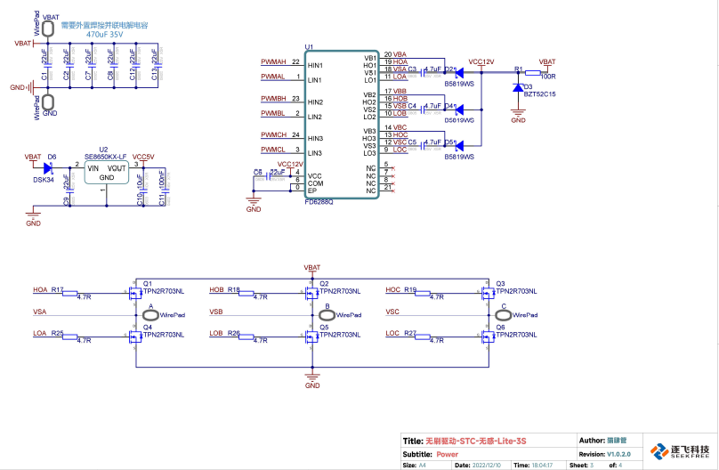
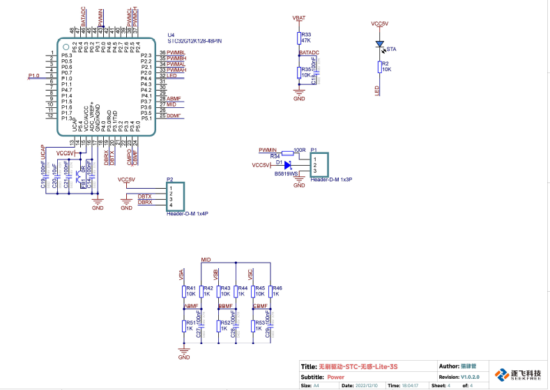
这里的图如果看不清楚不要紧，原理图的PDF文件会放到开源资料里的。

#### 2.4.逐飞STC无感无刷驱动开源项目的代码部分
逐飞STC无感无刷开源项目的目录结构如下图所示。

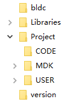

bldc文件夹下放置的是驱动无刷电机一些必要的单片机片内外设模块，例如PWM、比较器、等模块的初始化，以及逐飞科技精心编写检测转子位置和控制无刷电机转动必要的程序文件。
Libraries是逐飞科技的开源库，使用简单，调用函数即可实现对应的功能，不用自己操作复杂的寄存器。
MDK文件夹下放置的是工程项目文件，双击STC32G.uvprojx文件即可打开工程。
user文件夹下放置的是main.c、isr.h、isr.c文件。
Version文件夹下有版本说明

无感无刷驱动需要用到的外设主要有以下一些模块：
	ADC：主要用于检测电源电压，用于启动的时候自动计算启动占空比，以及锂电池低压保护。
比较器：主要用于过零信号的检测，通过判断过零信号来及时的进行换相。
GPIO：主要用于LED指示灯，用于显示各种状态。
PWM输入：使用通用定时器的输入捕获实现，对外部PWM信号的周期以及占空比获取。
PWM输出：主要用于输出三路PWM信号，用于驱动三路半桥。
周期定时器：主要用于产生周期信号，控制状态LED以及检测电机运行情况。
通用定时器：用于实现一些精度较高的延时，并触发中断。
UART：主要用于发送电机信息到虚拟示波器，便于查看电机运行情况。

#### 2.5.逐飞STC无感无刷驱动开源项目的程序工作流程讲解
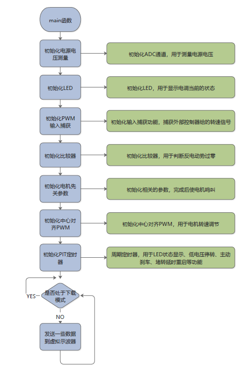

主函数主要的作用是初始化各种外设以及一些软件资源，然后在主循环中持续的发送电机信息到虚拟示波器，便于观察电机运行情况。

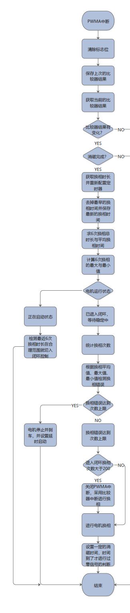

PWMA中断，是在输出PWM信号的高电平中间触发中断，在中断内读取比较器的输出信号，来判断是否有过零信号，这样的方式可以尽量的避开由于PWM信号快速切换导致的干扰信号，从而检测到错误的过零信号。这种方式会导致单片机中断频率较高，因此仅在启动阶段使用。

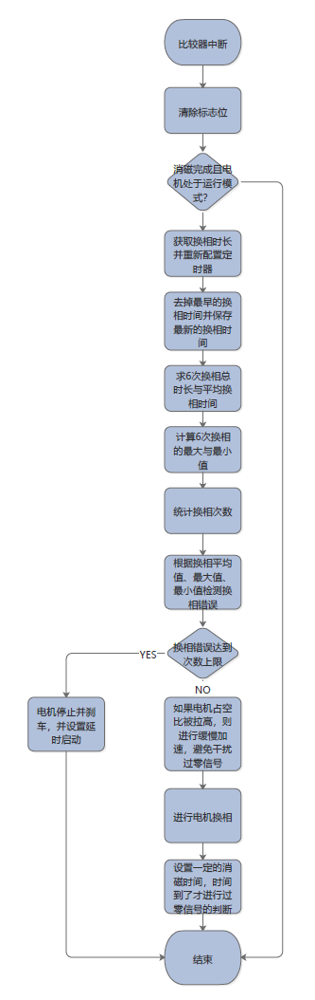

在电机成功启动之后，启用比较器中断，进入中断则表示检测到过零信号。电机启动之后干扰就很小了，因此电机启动之后采用比较器中断来判断过零信号。

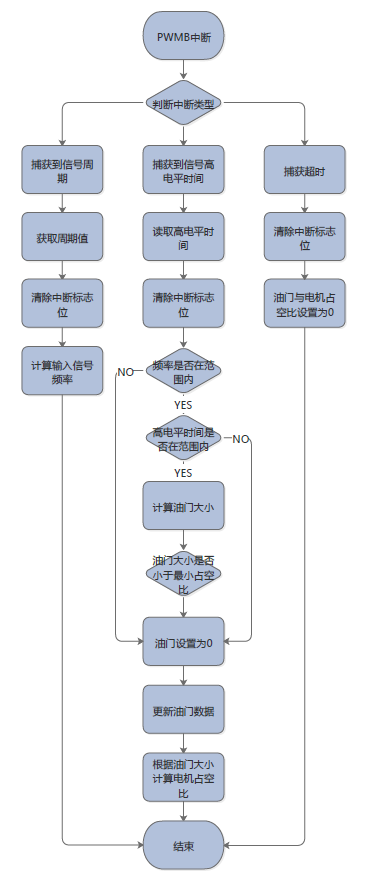

PWMB中断，主要用于对输入信号的处理，获取到输入信号的高电平与周期时间，从而计算油门大小。

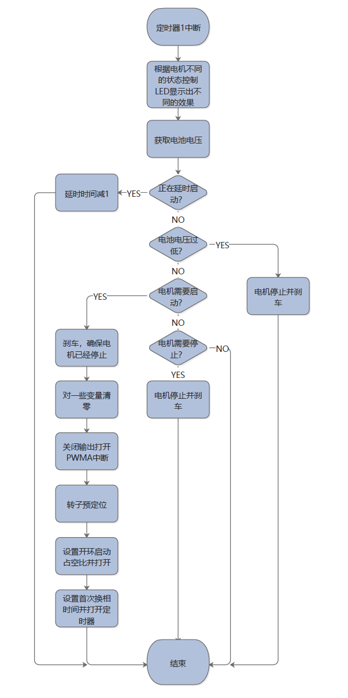

定时器1中断，每10ms运行一次，主要负责LED状态控制以及电机启动、停止、电池低电压保护。

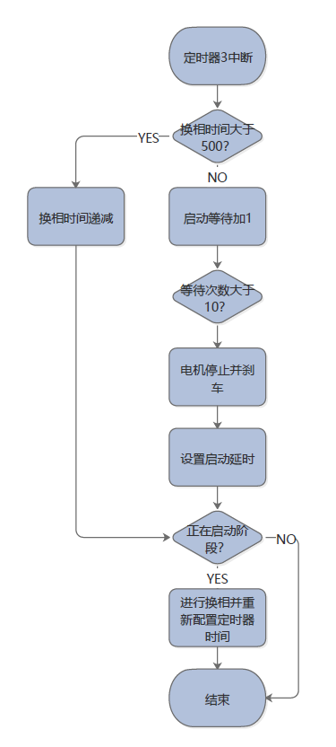

定时器3中断主要用于电机开环启动时使用，中断触发之后就强制进行换相并缩减下一次换相时间。直到电机启动完成或启动失败后退出。

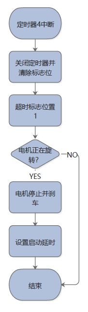

定时器4中断主要用于检测电机超时堵转。

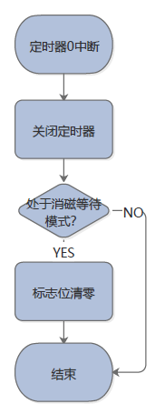

定时器0主要用于换相之后延时一定时间在进行过零信号的判断，消磁处理。

#### 三、逐飞制作好的参考学习驱动板简介及无刷电机推荐

#### 3.1.基于STC无感无刷电机驱动学习板端口简介
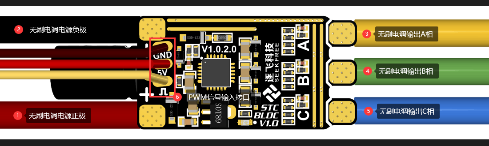
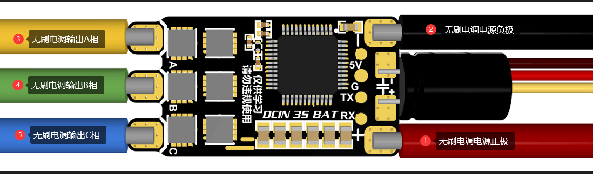

1.无刷电调电源正极：接3S电池正极

2.无刷电调电源负极：接3S电池负极

3.无刷电调输出A相：接无感无刷电机的任意一相

4.无刷电调输出B相：接无感无刷电机的任意一相

5.无刷电调输出C相：接无感无刷电机的任意一相

注意事项：电调的A、B、C应该分别接到无感无刷电机的三个引脚上，不能连接到同一个引脚上。
6.PWM信号输入接口：其中示意图中黄色的线是外部PWM信号输入，通过高电平时间来控制无刷电机转动的速度。具体可以查看5.1章节。红色的线是电调对外输出5V电压，不允许外部电源给电调此端口供5V电压。

#### 3.2.基于STC无感无刷电机驱动学习板端口简介
逐飞科技的STC32G无感无刷开源方案的电调，使用方式与舵机的控制方式相似，与商品电调的方式是一样的，信号端口与舵机端口是一样的，可以直接插在主板的舵机端口上。
无刷电调支持50-300hz的信号，信号的高电平时间范围是1-2ms，1ms时电机不转，2ms时电机满转。通过调节高电平的时间来改变无刷电机的转速。
无刷电调支持的功能如下：

1、仅支持3s锂电池供电。

2、支持低电压检测，低于设置的电压阈值后电机停止，避免对锂电池造成过放而损坏电池。

3、支持堵转检测，当检测到堵转之后会停止转动并等待一会儿重新进行启动。

4、支持上电电机鸣叫功能。

5、默认支持刹车，电机堵转或者控制电机停转的时候，可以实现快速关闭电机。

#### 3.3.无刷电机与螺旋桨推荐
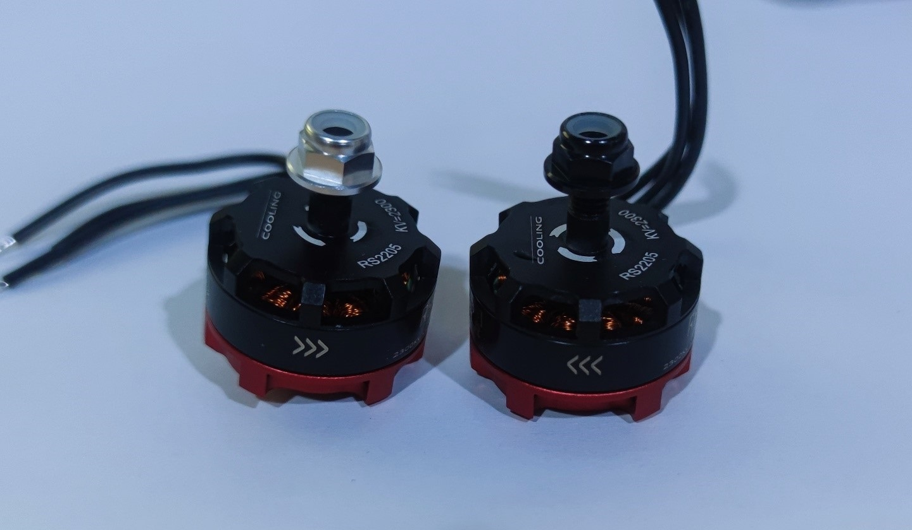

我们测试了多款电机，最终选择了这款电机体积小巧、重量轻、搭配我们的螺旋浆推力大。
温馨提示：此款电机仅为逐飞推荐款，同学们也可以选择自己认为合适的无刷电机，这一点上规则是没有限制的。

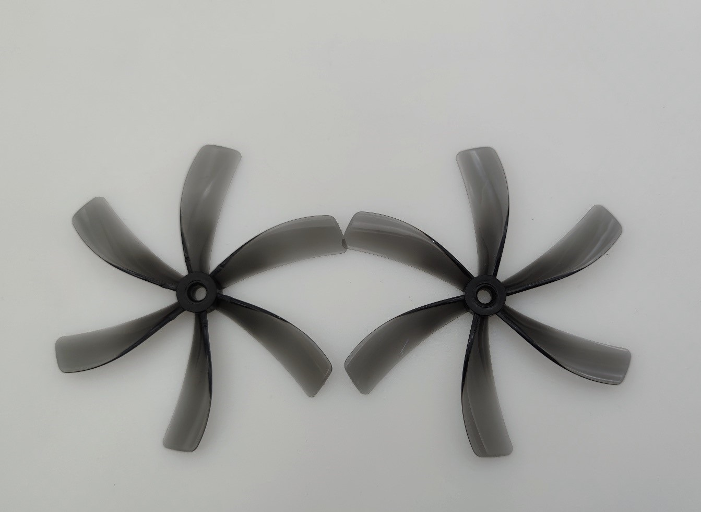

我们测试了多种螺旋浆，最终选择了这个6叶螺旋浆，体积适中。螺旋浆不能使用那种价格过于低廉的，在我们测试中发现价格低廉的螺旋浆动平衡很差，告诉转动很容易震动。

打包下载开源库压缩包，就可以愉快的开始玩无刷啦，各位下载之前别忘了帮我们点一点小星星哦，感谢各位的支持。
